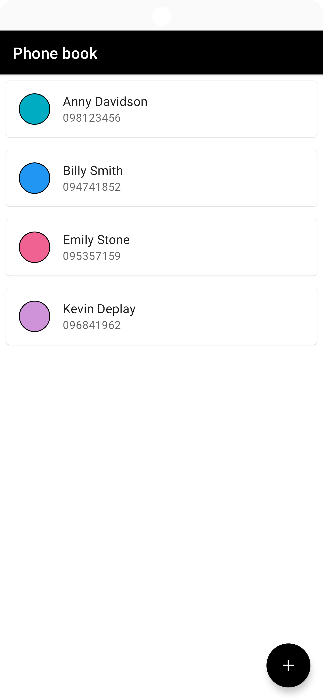
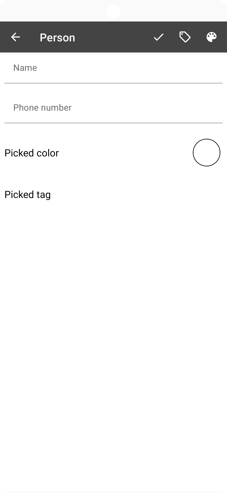
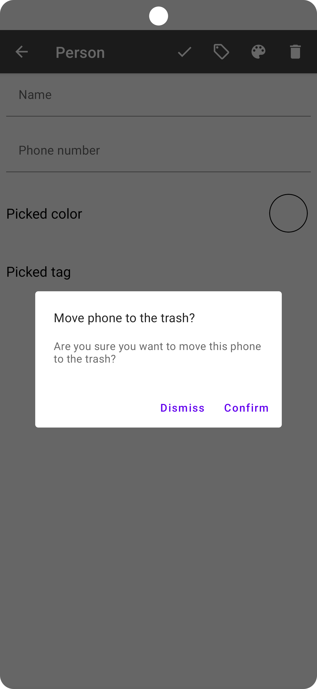
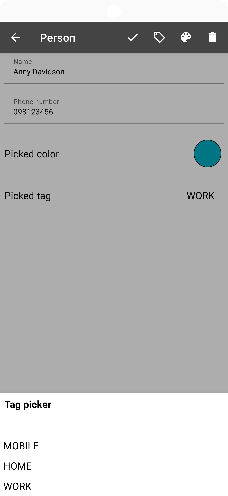
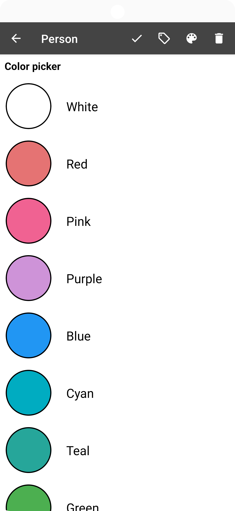

# CN333_Assignment 5

## Android App : PhoneBook
- เบอร์โทรศัพท์เรียงตามรายชื่อ
- สามารถTagเบอร์เป็นประเภทต่างๆ เช่น Home , Work , Mobile
- สามารถเพิ่ม แก้ไข และลบข้อมูลได้

# ขั้นตอนการใช้งาน
1. git clone https://github.com/6310620064/cn333as5.git
2. Android Studio เลือก file => new => import project => เลือกfileที่cloneไว้
3. กด Run or Shift + F10

# Demo สาธิตPhone Book
LinkVideo=> [Click_Here]

# ตัวอย่าง Display Android App

เมื่อเริ่ม start app ขึ้นมา

เมื่อกดเพิ่มcontact เบอร์เพิ่ม

เมื่อกดปุ่มdelete จะมีข้อความให้ยืนยันในการจะลบอีกครั้งนึง

เมื่อต้องการเลือกTag ต่างๆ

เมื่อต้องการเลือกสีต่างๆ

## ชื่อ : นางสาวภวิศา สิริโรจน์วรกุล
## เลขทะเบียนนักศึกษา : 6310620064
